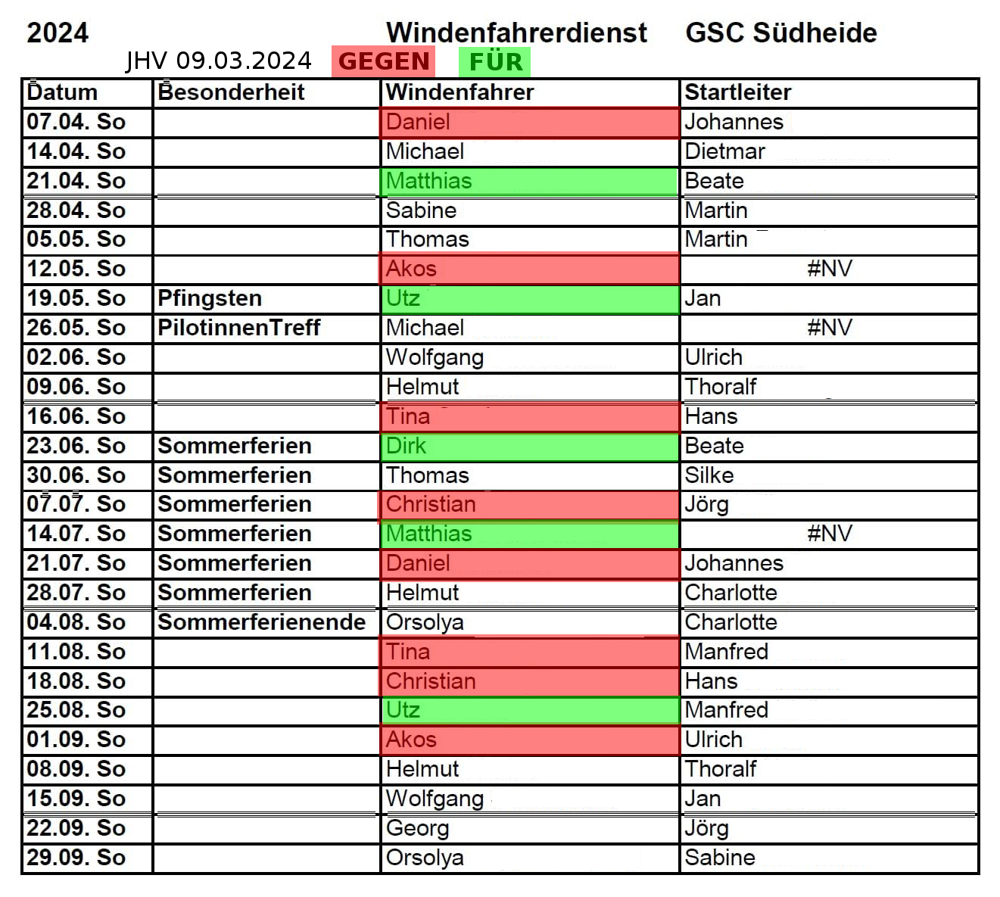

# Flugbetrieb Metzingen 2024

## Inhaltsverzeichnis

[Protokoll](#protokoll)
[Sondertage](#sondertage)
[Statistik](#statistik)
[Offene Probleme](#offene-probleme)
[Dienstplanen](#dienstplanen)
[Alternativen](#alternativen)

## Protokoll

JHV vom 07.03.2024, unten "10. Verschiedenes"

> Die Organisation des beschlossenen Probebetriebs Windenfahrerdienst wird von Utz
> vorgestellt. Nach der Diskussion wird Folgendes festgelegt:
>
> * An allen Sonntagen zw. April und Sept wird verbindlich ein Windenfahrer (WF) als
> Verantwortlicher festgelegt, die Dienste können getauscht werden. Maximal sind es 2
> Dienste pro WF.
> * Schleppbetrieb findet statt, wenn spätestens Samstag 10 Uhr 4 Teilnehmer (grün! in
> Verabredungstool auf Website) fliegen wollen, dabei zählen nur Mitglieder, aber auch WF
> und Startleiter*in.
> * Der/die WF bestimmt selbst, wann er/sie Schluss macht, er/sie beginnt den Tag nur. Es
> gibt keine minimale bzw. maximale Anzahl von Schlepps, die er /sie machen muss, da dies
> abhängig ist von seiner/ihrer körperlichen und mentalen Verfassung an diesem Tag. Es
> wird davon ausgegangen, dass Piloten sich zum Abwechseln der Diensthabenden
> bereiterklären.
> * Ein Startleiter*in soll auch jeweils bestimmt werden
> * Die Schriftführerin führt und pflegt die Tabelle mit den Diensten. Alle getauschten
>Termine sind der Schriftführerin umgehend mitzuteilen. Diese veröffentlicht die aktuelle
>Liste im internen Bereich auf der Website sowie in der Mitglieder-WhattsApp-Gruppe.

### Was vom Protokoll fehlt

Mehrere andwesenden Windenfahrer hatten gegen dem Diensplan protestiert. 

## Sondertage

| Tag | Bemerkung |
|---------:|-----------------------------------------|
|      17.03.| Kein Betrieb. Gutes Wetter, 2 Piloten mit gelb angemeldet [Screenshot von Akos](https://photos.app.goo.gl/czVUtiKxn8uRpdnp6) |
|      21.04.| Kräftiger Wind, 4 Starts. Ohne Dienstplan hätten wir wahrscheinlich kein Betrieb. |
|27. & 28.04.| Am 27.04. (Samstag) hätten wir wahrscheinlich fliegen können, es gab Freitag noch gar keine Anmeldungen. Für Sonntag wurde mehr Wind vorhergesagt. |
|      11.05.| Windenseminar mit Ines |
|25. & 26.05.| Pilotinnentreff |
|07. & 08.09.| Beiden Tagen hätten fliegbar gewesen, Pilotenmangel. |
|      29.09.| Schönes Wetter, ohne Dienstplan hätten wir wahrscheinlich anderswo geflogen. |

## Statistik 

Rohe Daten in [JSON](schlepps_2024.json)

Flugtage im DHV XC bzw Xcontest ab 2017 aus dem [notebook](./flight_days_checks.ipynb)

| Jahr   | Montag | Dienstag | Mittwoch | Donnerstag | Freitag | Samstag | Sonntag |  Total |
|:-------|------------------------:|-------------------------:|---------------------------:|--------------------------:|------------------------:|--------------------------:|------------------------:|----------------:|
| 2017   |                       1 |                        0 |                          0 |                         2 |                       2 |                         7 |                      13 |              25 |
| 2018   |                       2 |                        1 |                          0 |                         0 |                       8 |                         8 |                      14 |              33 |
| 2019   |                       1 |                        0 |                          1 |                         2 |                       3 |                         6 |                       9 |              22 |
| 2020   |                       1 |                        1 |                          3 |                         3 |                       1 |                         6 |                       2 |              17 |
| 2021   |                       0 |                        1 |                          0 |                         1 |                       0 |                         6 |                       7 |              15 |
| 2022   |                       1 |                        0 |                          0 |                         0 |                       2 |                         3 |                       5 |              11 |
| 2023   |                       0 |                        0 |                          1 |                         1 |                       3 |                         7 |                       8 |              20 |
| 2024   |                       3 |                        2 |                          1 |                         2 |                       1 |                         8 |                       8 |              25 |
| Total    |                       9 |                        5 |                          6 |                        10 |                      20 |                        50 |                      65 |             165 |

### Mangelperioden

* COVID-Verbot
* Kella-Winde Regelung kaputt ab ca. 08.10.2022 [Ladegerät](https://photos.app.goo.gl/jWHgNVxGqZ1k3UQU8) bis Frühling 2023
* ELOWIN im Betrieb ab 18.03.2023?

## Offene Probleme

### Haben wir Tagen verpasst?

#### Wetter

Schwierig. Basiert auf DWD distorische Daten?

Siehe Regression [notebook](./flight_days_checks.ipynb)

#### Flugbetrieb in der Umgebung

Details siehe [notebook](./dhvxc/dhvxc_region.ipynb)

Anhand der Anzahl der DHV XC Flüge im Gelände in der Umgebung (Lüdingen,  Leese,  Estorf, Brunsberg, Kella,  Börry, Porta, Königszinne, Rammelsberg), versuchen RandomForestRegressor zu trainieren. Trainingsdaten aus 2023, Testdaten dann 2024. Nur Samstags und Sonntags!

Laut RandomForestRegressor haben wir folgenden Wochenendstagen in 2024 verpasst:

| Datum   |   Lüdingen |   Leese |   Estorf |   Brunsberg |  Kella |   Börry |   Porta |   Königszinne |   Rammelsberg | HAJ Wind dir   |   HAJ Wind str |   predict |
|:-------------|-----------:|--------:|---------:|------------:|-------------:|--------:|--------:|--------------:|--------------:|:---------------|---------------:|----------:|
| 2024-01-28   |          0 |       0 |        2 |           0 |            0 |      10 |      14 |             0 |             0 | SSO            |          21.24 |      8.67 |
| 2024-03-02   |          0 |       0 |        0 |           0 |            0 |      17 |      30 |             0 |             0 | SSO            |          18.36 |      6.27 |
| 2024-04-06   |          0 |       0 |        0 |           0 |            0 |      20 |      23 |             0 |             0 | SSO            |          20.88 |      6.15 |
| 2024-04-27   |          0 |       0 |        0 |           0 |            0 |      14 |      29 |             0 |             0 | SSO            |          20.88 |      6.35 |
| 2024-07-20   |          5 |       0 |       15 |           3 |            2 |       7 |       2 |             0 |             0 | O              |          14.4  |      5.23 |
| 2024-09-07   |         14 |       0 |       17 |           1 |            0 |       0 |       0 |             0 |             0 | O              |           9.36 |     12.29 |
| 2024-09-08   |          0 |       0 |        0 |           0 |            0 |       0 |       0 |             0 |            11 | W              |          14.76 |      6.2  |
| 2024-09-21   |         21 |       0 |        0 |          12 |            6 |       0 |       0 |             0 |             0 | O              |          19.8  |     10.09 |

### Streckenflugpotential besser ausnutzen

DHV XC Daten [notebook](./dhvxc/dhvxc_Metzi.ipynb)

|   Jahr |  # Flüge > 50 Punkte | # Flüge > 30 Punkte* |
|-------:|----------------------:|----------------------:
|   2024 |                     4 |                    10|  
|   2023 |                    11 |                    23|
|   2022 |                     7 |                    11|
|   2021 |                     1 |                     3|
|   2020 |                     3 |                     8|
|   2019 |                     6 |                     9|
|   2018 |                    14 |                    20|

(*) 15 km FAI = 30 Punkte im DHV XC

### Vereinsarbeit besser verteilen

Siehe [Punktsystem](#punktsystem-verein)

### Flugsicherheit 

* Wie viel Praxis (Schlepps, Schlepptage) braucht ein WF (pro Jahr), um die Piloten nicht zu gefährden?
* Wie viele Schlepps pro Tag pro WF sind noch sicher? Wie viele Stunden sind noch sicher an einem Hitzetag?

## Dienstplanen

### Fahrdienst HDGV

Nicht vergleichbar.

* Gleichbeteiligung: Alle Mitglieder sind eingeteilt (nicht nur eine Minderheit wie die WF)
* Vereinsarbeit: Kein Windenverein => Fahrdienst grundsätzlich einzige Möglichkeit in der Arbeit teilzunehmen
* Flugerwartungen am Diensttag: An guten Tagen kann man trotz Fahrdienst mit einem längeren Flug rechnen.
* Kalendarabdeckung: Viel mehr Mitglieder => Samstag, Sonntag + Feiertage können mit 2 Fahrer
* Shuttle fahren 4 Stunden vs Winde fahren 4 Stunden in der Hitze?

### Windenfahrerdienst Deisterflieger

* Weniger Gastflieger (mindestens keine öffentlichen Kalender)
* Streckenflugpotenzial deutchlich niedriger: Lufträume, Lee-Lage (absteigende Luftmasse)

### Windenfahrerdienst GSC Landesbergen

* 2 Schleppstrecken (Grundsätzlich alle Windrichtungen)
* Sie hatten WF-Plan, haben aber abgelöst

### Lüdingen

Aktuell keinen Dienstplan.

### Windenfahrerdienst beim Segelflugbetrieb

Nicht vergleichbar.

* Weniger Wetter-Abhängig
* Betrieb braucht mehr Personal
* Ortsgebunden

## Alternativen

### WF-Anteil erhöhen `VEREIN`

* Stand Oktober 2024 : mehrere WiFA

### Wetterdienst `VEREIN` 

* Ausgewählten Mitglieder halten das Wetter im Auge

### Punktsystem `VEREIN` 

* Am Jahresbeginn nimm Anzahl `N` von Schlepps als Durchschnitt aus dem letzten 3 (oder 5) Jahren

#### WF 

  * Ziehe `A` = 60 * Anzahl von WiFA (oder Pauschal 2) ab
  * Verteilen Zwischen `W` Windenfarher - ohne EWFs und WiFAs
  * Schlepps zu Leisten: `n = (N - A)/w`
  * Schlepps pro WF *veröffentlichen*
  * Nach `n` geschafften Schlepps weitere Vorteile an WF

#### Nicht-WF

  * `M` Anzahl von nicht-WF
  * Startleitertätigkeiten zu Leisten: `N/M`
  * Auch veröffentlichen

### Kalender-Regeln überdenken `VEREIN`

* Anmeldungsfrist 20:00 Vorabend 
  * auch technisch (im Kalender) 
  * persönliches Engagement von Piloten verstärken
* "gelb" streichen

### Fernbedienung `VEREIN`

* weniger Anwesenden gebraucht

  * hauptsätzlich in der Woche - in der Regel kein Mischflugbetrieb
  * Am Wochenende gibt's mehr Leute

### Kooperation mit den anderen Vereinen verstärken `REGIO`

* Gemeinsame Anmeldungstool
* Piloten &  WF(!) austausch

### Selbstschlepp `DHV`

* Nur langfristige Lösung

