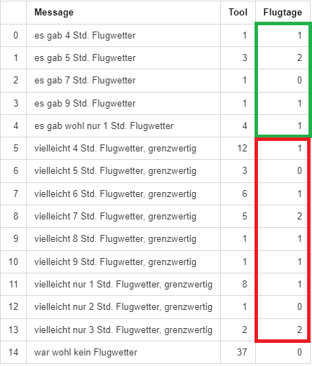
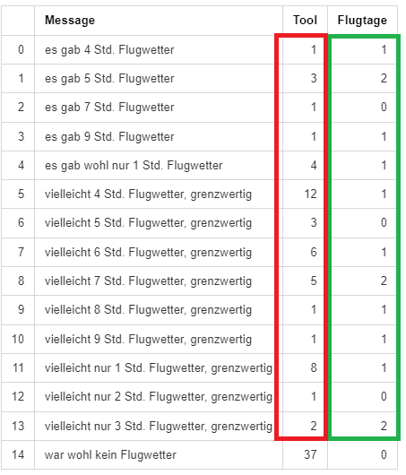

# Status 18.11.2024

* Auswertung für Samstags und Sonntags 2024
* "Flugwetter" : precision  0.5  recall  0.357
 
* "Flugwetter" + "grenzwertig" : precision  0.286  recall  1.0

|    | Message                                       |   Tool          |   Flugtage   |
|---:|:----------------------------------------------|----------------:|-------------:|
|  0 | es gab 4 Std. Flugwetter                      |               1 |            1 |
|  1 | es gab 5 Std. Flugwetter                      |               3 |            2 |
|  2 | es gab 7 Std. Flugwetter                      |               1 |            0 |
|  3 | es gab 9 Std. Flugwetter                      |               1 |            1 |
|  4 | es gab wohl nur 1 Std. Flugwetter             |               4 |            1 |
|  5 | vielleicht 4 Std. Flugwetter, grenzwertig     |              12 |            1 |
|  6 | vielleicht 5 Std. Flugwetter, grenzwertig     |               3 |            0 |
|  7 | vielleicht 6 Std. Flugwetter, grenzwertig     |               6 |            1 |
|  8 | vielleicht 7 Std. Flugwetter, grenzwertig     |               5 |            2 |
|  9 | vielleicht 8 Std. Flugwetter, grenzwertig     |               1 |            1 |
| 10 | vielleicht 9 Std. Flugwetter, grenzwertig     |               1 |            1 |
| 11 | vielleicht nur 1 Std. Flugwetter, grenzwertig |               8 |            1 |
| 12 | vielleicht nur 2 Std. Flugwetter, grenzwertig |               1 |            0 |
| 13 | vielleicht nur 3 Std. Flugwetter, grenzwertig |               2 |            2 |
| 14 | war wohl kein Flugwetter                      |              37 |            0 |